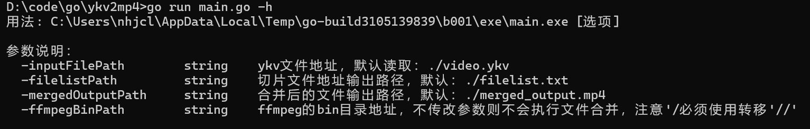
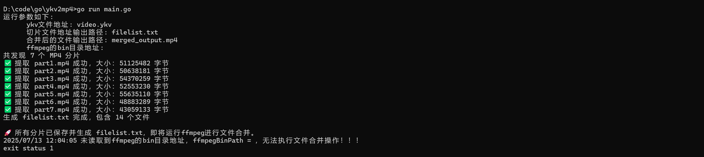
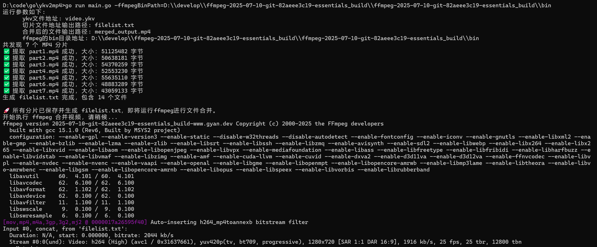
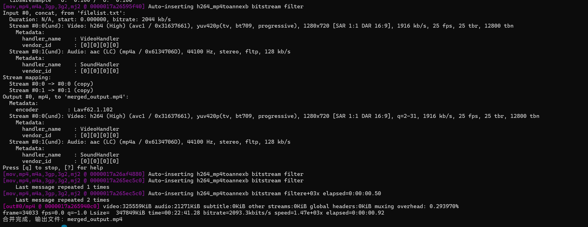
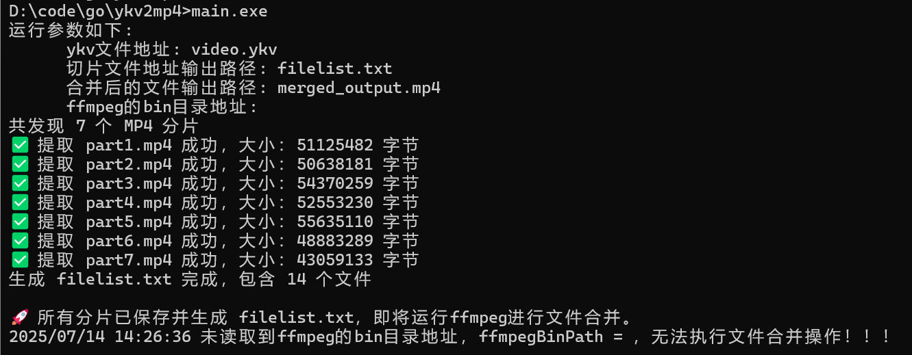
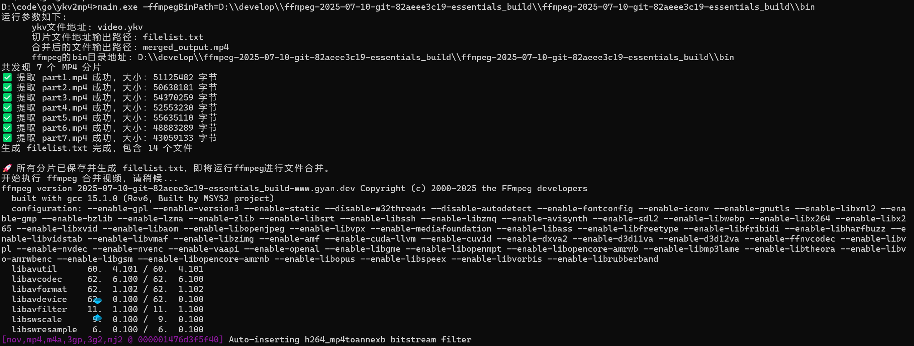
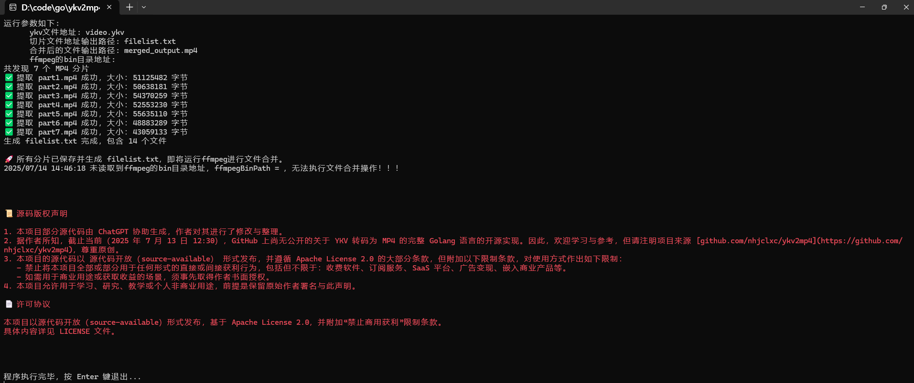

# ykv2mp4
将优酷的ykv视频解码为普通的MP4格式文件

ykv转mp4
ykv转码mp4
优酷视频解码
优酷ykv解码

# 使用golang和ffmpeg实现优酷ykv视频解码为mp4

# 一、环境准备

## 1.1、golang环境

- 版本`go version`：go version go1.24.0 windows/amd64
- 下载地址：[官网](https://golang.google.cn/dl/)里面找到go1.24.*.windows-amd64.zip，只要是go1.24版本即可
- **必须安装**

## 1.2、ffmpeg环境
- 版本`ffmpeg version`：ffmpeg version 2025-07-10-git-82aeee3c19-essentials_build-www.gyan.dev Copyright (c) 2000-2025 the FFmpeg developers
- 下载地址：[官网](https://www.gyan.dev/ffmpeg/builds/)或者[github](https://github.com/GyanD/codexffmpeg/releases/tag/2025-07-10-git-82aeee3c19)找到ffmpeg-2025-07-10-git-82aeee3c19-essentials_build.7z之后解压到指定路径
- **若不使用视频合并功能，可不安装**

# 二、脚本执行

# 2.0 查看所有支持的命令

执行命令：`go run main.go -h`

# 2.1 不合并视频

执行命令：`go run main.go`

# 2.2 合并视频

执行命令：`go run main.go -ffmpegBinPath=D:\\develop\\ffmpeg-2025-07-10-git-82aeee3c19-essentials_build\\ffmpeg-2025-07-10-git-82aeee3c19-essentials_build\\bin`

# 2.3 使用可执行文件ykv2mp4.exe

考虑到很多朋友没有编码能力，因此我编译了一个可执行文件 **ykv2mp4.exe** 使得大家使用起来更佳方便，该 exe 仅2.76MB。

# 三、源码版权声明

1. 本项目部分源代码由 [ChatGPT](https://chatgpt.com/) 协助生成，作者对其进行了修改与整理。
2. 据作者所知，截止当前（2025 年 7 月 13 日 12:30），GitHub 上尚无公开的关于 **YKV 转码为 MP4** 的完整 Golang 语言的开源实现。因此，**欢迎学习与参考，但请注明项目来源 [github.com/nhjclxc/ykv2mp4](https://github.com/nhjclxc/ykv2mp4)**，尊重原创。
3. 本项目的源代码以 **源代码开放（source-available）** 形式发布，并遵循 Apache License 2.0 的大部分条款，但附加以下限制条款，**对使用方式作出如下限制**：
    - **禁止将本项目全部或部分用于任何形式的直接或间接获利行为**，包括但不限于：收费软件、订阅服务、SaaS 平台、广告变现、嵌入商业产品等。
    - 如需用于商业用途或获取收益的场景，**须事先取得作者书面授权**。
4. 本项目允许用于学习、研究、教学或个人非商业用途，前提是保留原始作者署名与此声明。

# 📄 许可协议

本项目以源代码开放（source-available）形式发布，基于 Apache License 2.0，并**附加“禁止商用获利”限制条款**。具体内容详见 [LICENSE](./LICENSE) 文件。
